# Project 3: Building a Flight Controller in C++
##Project Scope
This project is about to develop a flight controller for a quadrotor in C++.

The flight controller is made up of the main control blocks listed below. Note that a PD or PID controller is used when the output of a control block comes from the second derivative of the input (second order system), whereas a P controller is used when the output comes from a first derivative of the input.

+ **Altitude controller**: PID Controller
+ **Lateral controller**: PD Controller 
+ **Yaw controller**: P Controller
+ **Body rate controller**: P Controller
+ **Roll/Pitch controller**: P Controller

Next figure shows an overview of the whole controller and the interactions (inputs, outputs) between its building blocks as well as the planner and the own vehicle (quadrotor) being controlled. Note how the different control blocks are arrange in cascaded scheme.

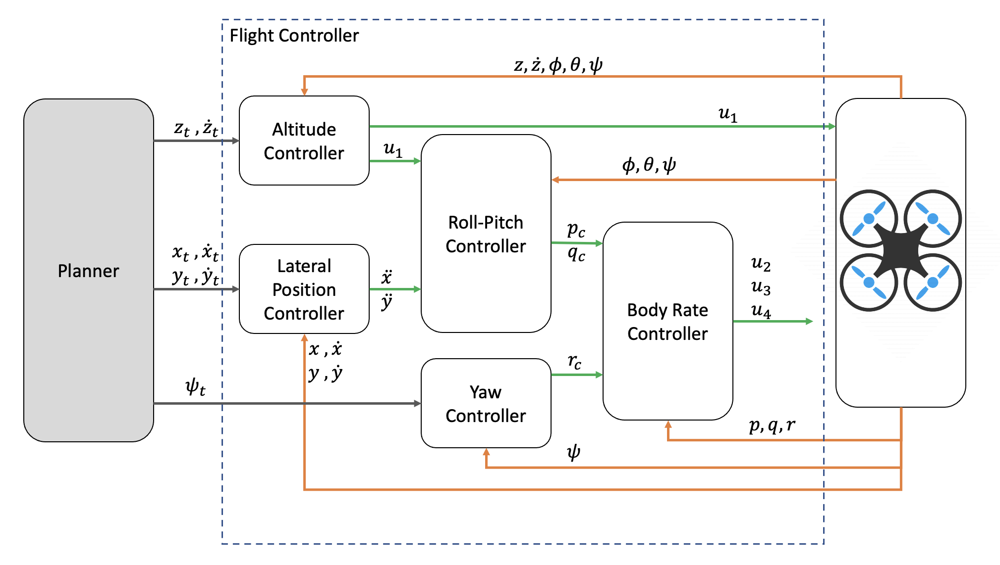

The resulting code will control a quadrotor in a synthetic environment: the C++ simulator. The simulator provides different fly scenarios. The simulator and project scenarios were largely designed and built by [Fotokite's](https://fotokite.com) team and [Sergei Lupashin](https://www.youtube.com/watch?v=9dXEam9kVKk) in particular. The C++ simulator can be download from and installed according to its [Github repository](https://github.com/udacity/FCND-Controls-CPP).

## Writeup
This brief report discuss on how the rubric points for passing the project are addressed. It includes brief explanations, statements and supporting images, including screenshots of the piece of code in which each step is handled.

## Implemented Controller
### Implement body rate control in C++
Body rate control is made by means of a P controller implemented in the function named ``BodyRateControl``.

The controller commands 3-axis momments in body frame. These moments are calculated by the body rate error vector, between the commanded body rates and the estimated ones, times the corresponding gain factor times the moment of inertia of the vehicle expressed in body frame. Commanded and estimated body rates are inputs of the controller and come from, on the one hand, the roll-pitch and yaw controllers and, on the other, from the drone sensors respectively. The gain factor and the moment of inertia are input as parameters at ``QuadControlParams.txt`` file.

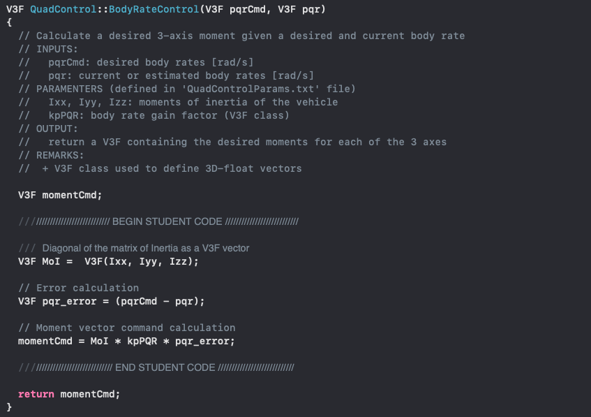

### Implement roll-pitch control in C++
Roll-Pitch control is made by means of a P controller implemented in the function named ``RollPitchControl``.

The controller commands roll and pitch body rates. Since they are given in body frame while the x and y accelerations input in the controller are in world (inertial) frame, the rotation matrix is required as part of the involved calculation. The rotation matrix R is derived from the estimated attitude of the vehicle.

Roll and pitch body rates are calculated by means of the rate of change of the rotation matrix items R13 (bx) and R23 (by). These latter are calculated by the error between the commanded and estimated rotation matrix items times the the corresponding gain factor.

+ The commanded rotation matrix items bx and by are derived from the x and y componentes of the dynamic equations for translational motion of a quadrotor. They are calculated by dividing the commanded x and y accelerations by the collective thrust, once normalized by the vehicle mass. Commanded x and y accelerations and collective thrust are input from the lateral controller and the altitude controller respectively. Vehicle mass is input as a parameter at ``QuadControlParams.txt`` file.
	
+ The estimated rotation matrix items bx and by are directly taken from the current estimate attitude of the vehicle, that is, from the estimate rotation matrix.

Once the rate of change of the rotation matrix items bx and by are evaluated, they are directly mapped to the commanded body rates p and q using the estimated rotation matrix.

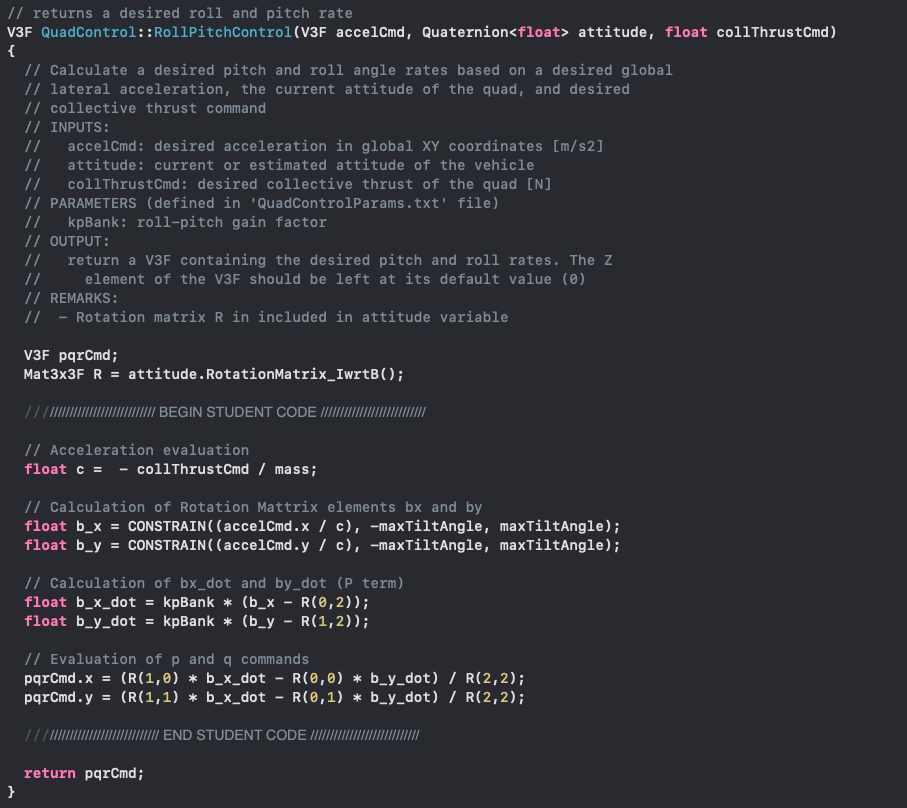

### Implement altitude control in C++
The altitude control is made by means of a PID controller with feedforward, which is implemented in the function named ``AltitudeControl``. 

The controller commands the collective thrust of the vehicle. This is derived from the z component of the dynamic equation for translational motion of a quadrotor. Therefore, the thrust is calculated by the substracion of the gravity acceleration to the commanded z acceleration, times the mass of the vehicle and all divided by itemm R33 of the rotation matrix. Note that the rotation matrix is involved in the calculation since z-location is given in world (inertial) frame whereas the collective thrust is given in body frame. The rotation matrix is derived from the estimated attitude of the vehicle.

The commanded z acceleration is, in turn, calculated by the implementation of a PID controller with feedforward.

The feedforward term is given by the previously commanded z acceleration.

The I-term, to account for bias in altitude, is given by the acumulated z-position error times the corresponding I-gain factor (KiPosZ).

+ The accumulated z-position error is evaluated by the z-position error times the delta-t before previous control action.
+ The z-position error is is the difference between the z-position commanded by the planner (input in the controller) and the z position estimated by the vehicle's sensors.

The D-term is given by the velocity error times the corresponding D-gain factor (kpVelZ).

+ The velocity error is evaluated by substracting the estimated velocity to the commanded velocity.
+ And the commanded velocity is evaluated by the z-position error times the corresponding P-gain factor (kpPosZ) plus the previously commanded velocity (feedforward).
+ Besides, the velocity is contrained between the max/min vertical speed defined by the application of the ``CONTRAIN``function.

Finally, the P-term is already implicitly included in the D-term calculation since it uses the commanded velocity, wihch is calculated by appling a proportional control.

All the gain factors as well as the vertical speed limit are input as parameters at ``QuadControlParams.txt`` file.

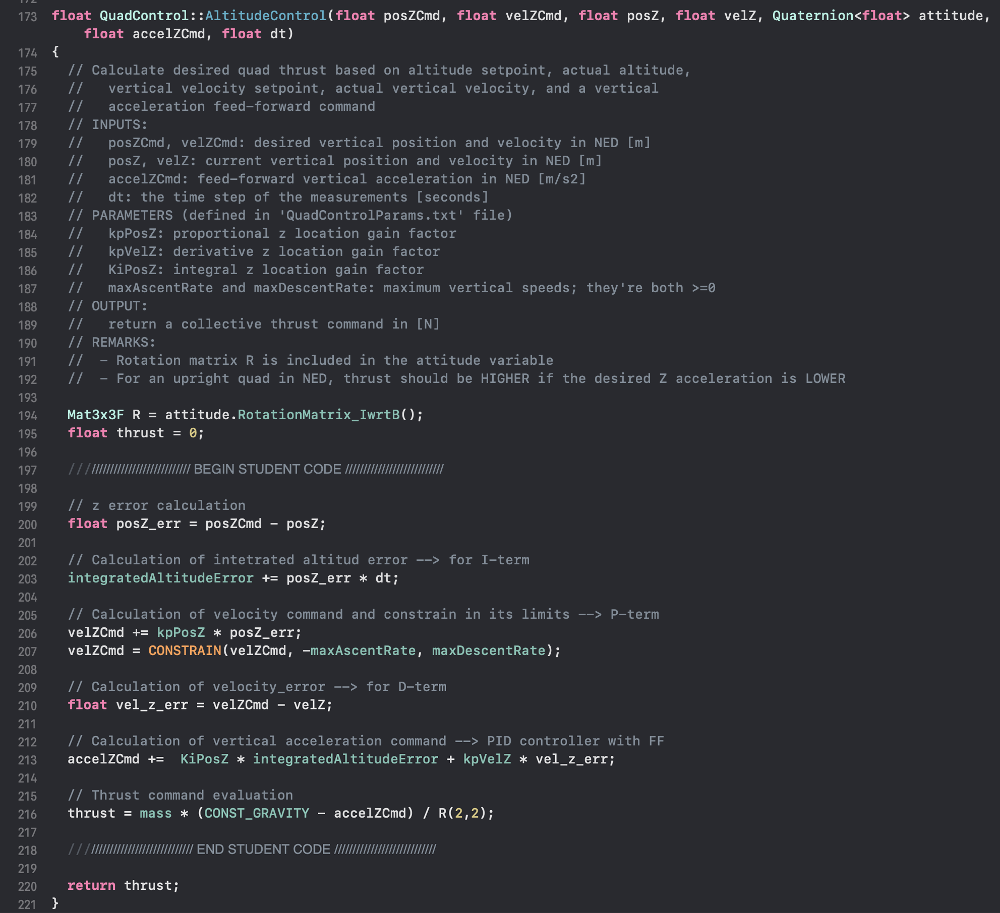

### Implement lateral position control in C++
The lateral position control is made by means of a PD controller implemented in the function named ``LateralPositionControl``.

The controller commands the x and y accelerations. They are calculated by the implementation of a PD controller with feedfoward. Since both inputs and outputs of the controller are given in world (inertial) frame, the use of the rotational matrix is not required here.

The P-term is inserted during the calculation of the commanded velocity. This is evaluated by the position error (in both x and y components) times the corresponding P-gain factor (kpPosXY) plus the previously commanded velocity (feedforward).

+ The position error is evaluated for x and t by substracting the estimated position to the commanded position provided by the planner.
+ Besides, the velocity is contrained to not exceed the defined maximum XY speed by the application of the ``CONTRAIN``function.

The D-term is introduced for the calculation of the commanded acceleration. This is evaluated by the velocity error (in both x and y components) times the corresponding D-gain factor (kpVelXY) plus the previoulsy commanded acceleration (feedforward).

+ The velocity error is evaluated for x and y by substracting the estimated velocity to the commanded velocity calculated by the P-term.

+ Besides, the acceleration is contrained to not exceed the defined maximum XY acceleration by the application of the ``CONTRAIN``function.

+ The velocity error is evaluated by substracting the estimated velocity to the commanded velocity.
+ And the commanded velocity is evaluated by the z-position error times the corresponding P-gain factor (kpPosZ) plus the previously commanded velocity (feedforward).
+ Besides, the velocity is contrained between the max/min vertical speed defined by the application of the ``CONTRAIN``function.

All the gain factors and the velocity and acceleration limits are input as parameters at ``QuadControlParams.txt`` file.

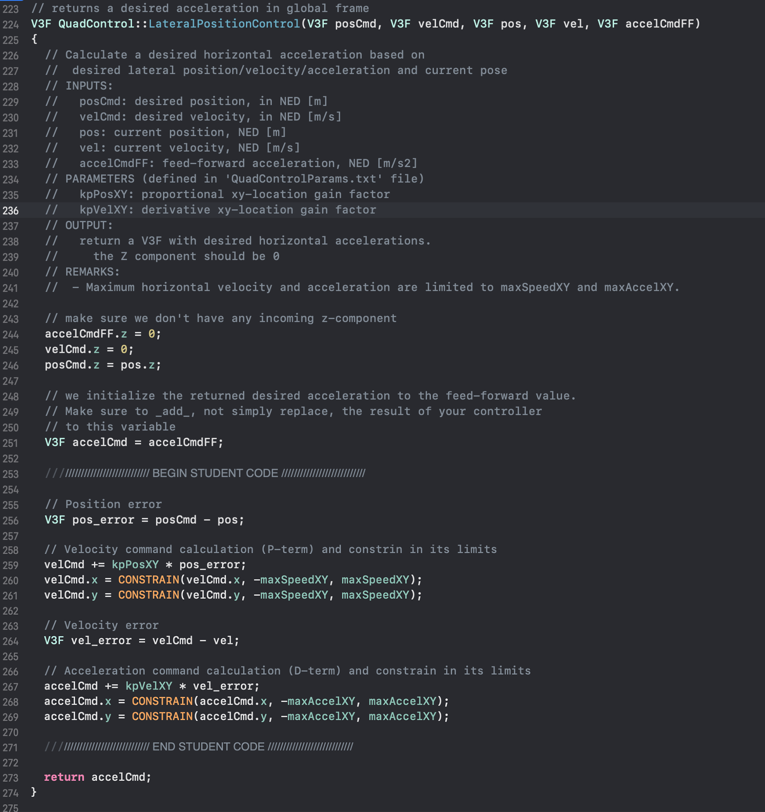

### Implement yaw control in C++
Yaw control is made by means of a P controller implemented in the function named ``YawControl``.

The controller commands yaw rate, which is calculated by the yaw angle error, between the one commanded and the estimated one, times the corresponding gain factor. Commanded and estimated yaw angles are inputs of the controller and come from the planner and the drone sensors respectively. The gain factor is input as a parameter at ``QuadControlParams.txt`` file.

Note that yaw error is force to be in the range [0,2 * pi] by means of the function ``fmodf(x,y)``, which computes the floating-point remainder of the division operation x/y.

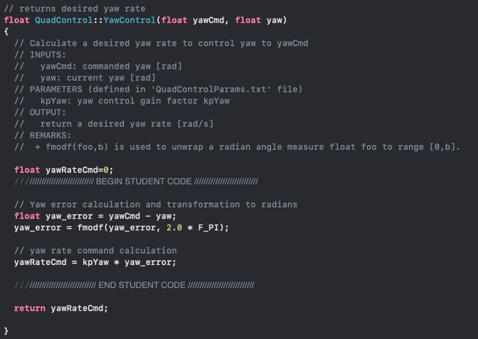

### Implement motor commands in C++
The function ``GenerateMotorCommands`` is responsible of converting a desired 3-axis moment and collective thrust command to individual motor thrust commands.

The function output the thrust at every of the four rotors of the quadrotor needed to provide a desired 3-axis moment and collective thrust commands (input).

The following elements are considered:
+ Each rotor of the quadrotor produces not only a force F in the positive z-directions but also a reaction torque M perpendicular to the plane of roation of its blade
+ All the four rotors provide the same thrust and reaction torque
+ Rotors 1 and 3 rotate towards the negative a-direction; therefore, they produce a reactive moment that acts in the positive z-direction
+ Rotors 2 and 4 rotate towards the possitive a-direction; therefore, they procude a reactive moment that acts in the negative z-direction
+ It is considered that the four propelers are placed in the vertex of a square and the length of the diagonal of that square is 'L'. It is given as a parameter at ``QuadControlParams.txt`` file.
+ The moment arm 'l' to calculate the moments in roll and pitch moments (x and y body axis respectively) produced by each rotor is calculated by 'L' divided by the square root of 2.
+ kappa is a constant that maps the torque (Nm) produced by rotor per N of thrust produced (M = kappa x F). It is given as a parameter at ``QuadControlParams.txt`` file.

With this considerations, the function first calculates the individual rotor thrust to generate separately each of the desired collective thrust and moments: A, B, C and C values.

Then, the function properly agregates these values to get the required force at each rotor to provide the whole set of desired collecrive thrust and 3-axis moments: F1, F2, F3 and F4. Finally, these forces are constrained to not exceed the max/min thrust that the rotors are able to provide. Note that minMotorThrust and maxMotorThrust are given as a parameters at ``QuadControlParams.txt`` file.

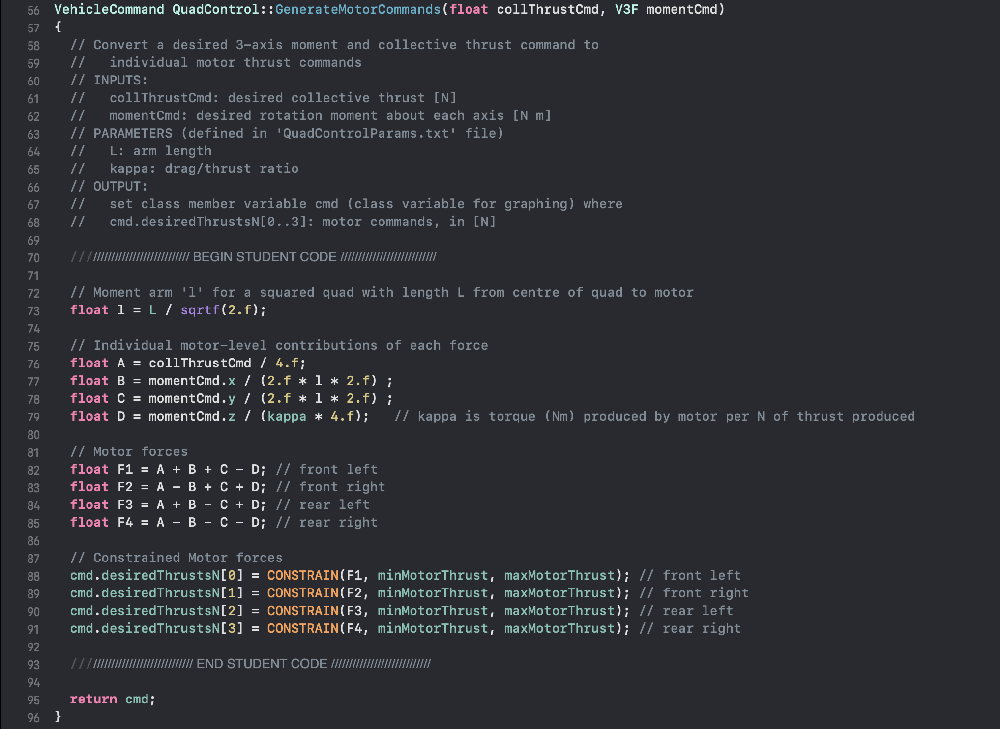

## Flight Evaluation
The flight controller developed as explained before has been tuned for the virtual quadrotor implemented in the C++ simulator according to the following list of control parameters. These parameters are defined in ``QuadControlParams.txt`` file.

	Position control gains:
	  kpPosXY = 3
	  kpPosZ = 3.5
	  KiPosZ = 23
	
	Velocity control gains:
	  kpVelXY = 9
	  kpVelZ = 10
	
	Angle control gains:
	  kpBank = 15
	  kpYaw = 3.5
	
	Angle rate gains:
	  kpPQR = 60, 60, 8

Tuned this way, the quadrotor is able to keep a stable fly in the following scenarios implemented in the C++ simulator. The performance of the quadrotor in every scenario is reported by means of images, in which the log of the simulator is shown at the botton of every image.

### Scenario 1

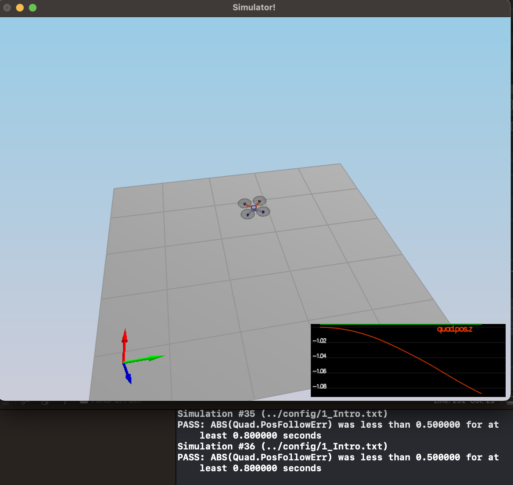

### Scenario 2

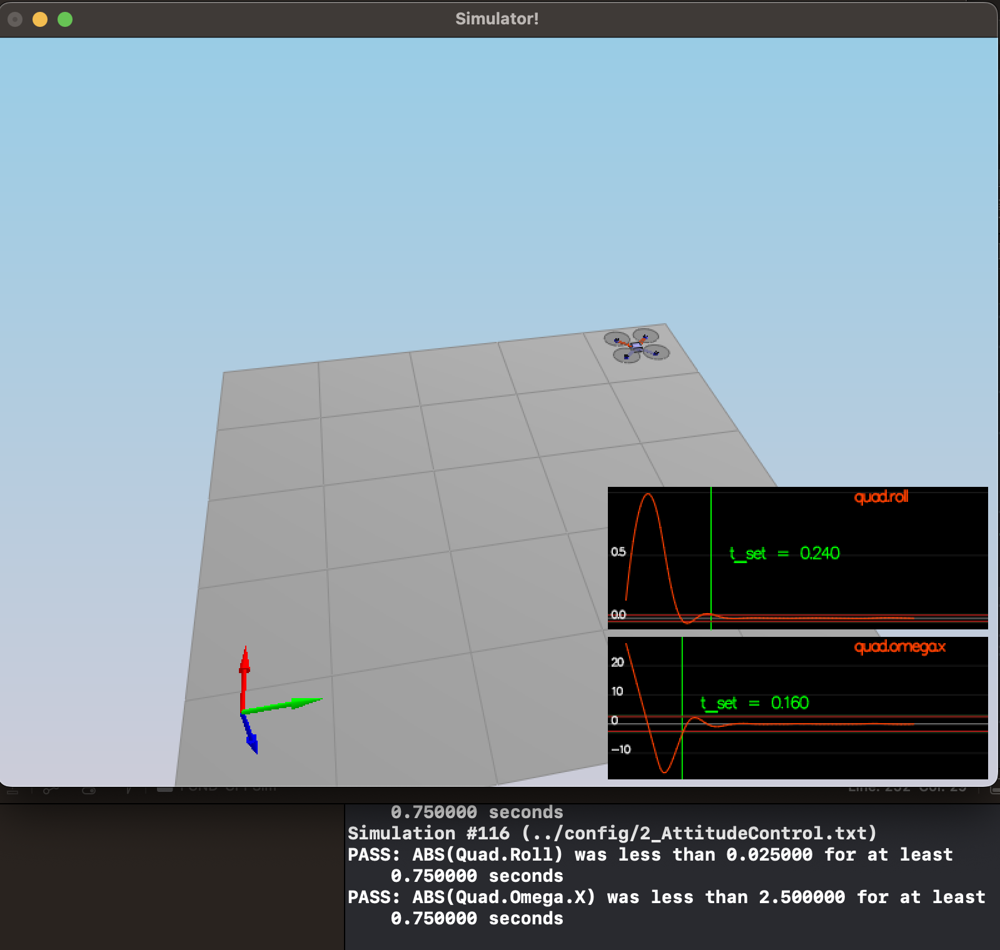

### Scenario 3
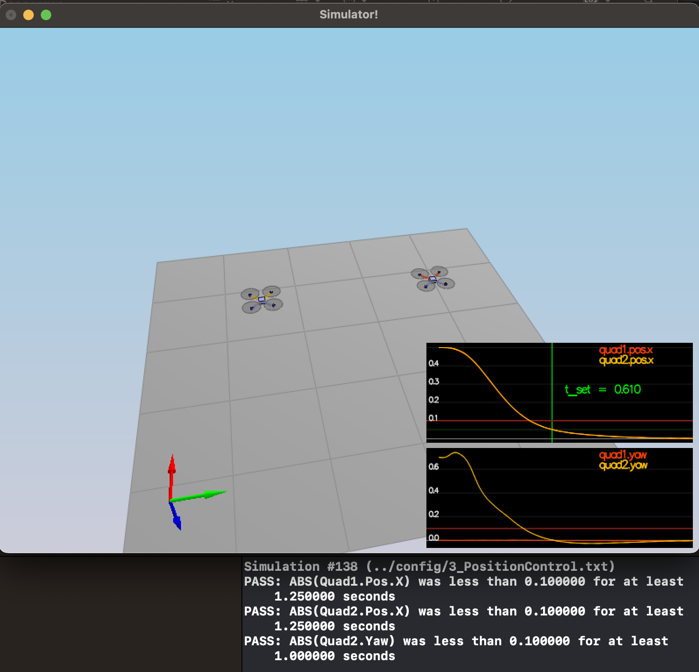

### Scenario 4
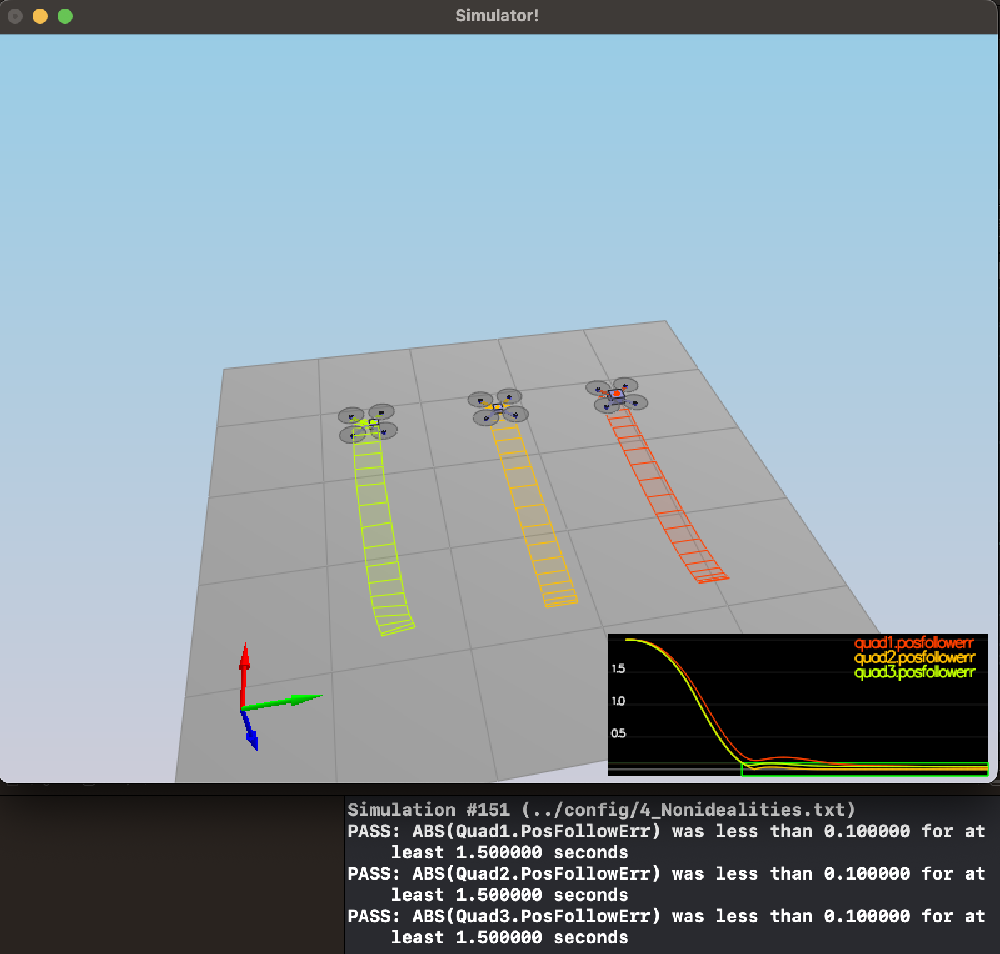

### Scenario 5
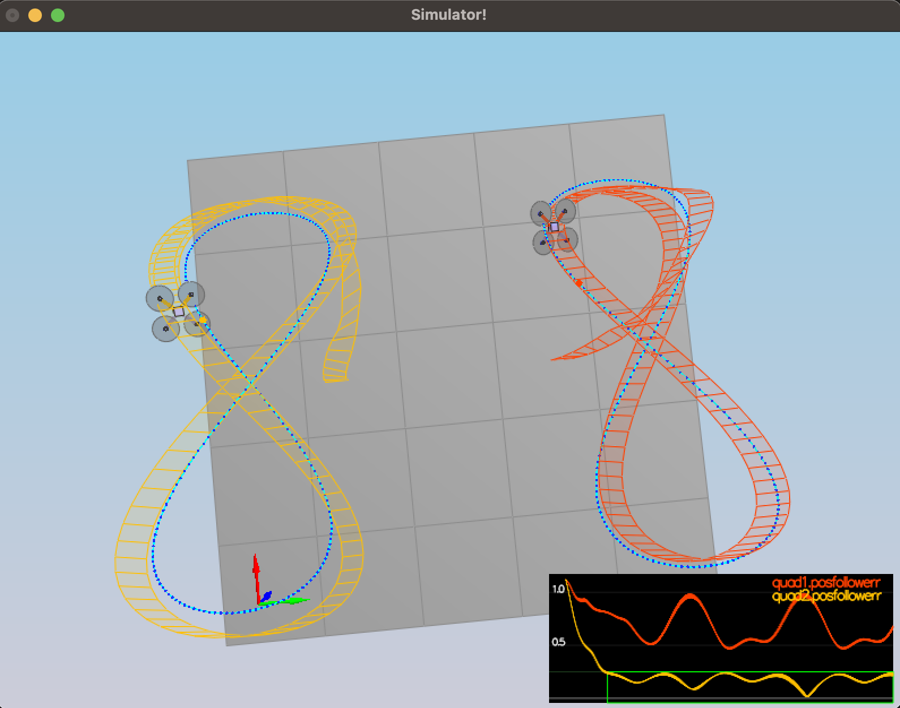

