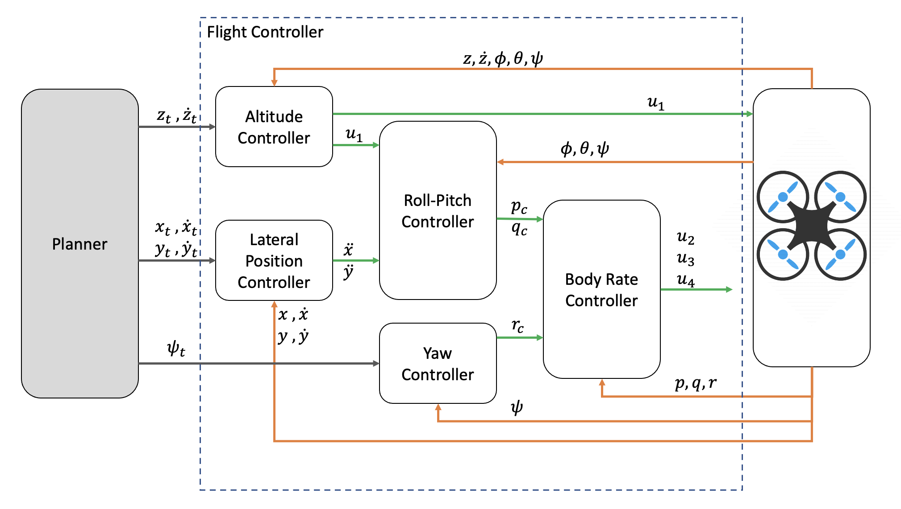

# Project 3: Building a Flight Controller in C++
## The Project
Here you can find my implementation of the second project of the [Flying Car and Autonomous Flight Engineer Learning Nanodegree](https://www.udacity.com/course/flying-car-nanodegree--nd787), called Control of a 3D Quadrotor.

This project is about to develop a flight controller for a quadrotor in C++.

The flight controller is made up of the main control blocks listed below. Note that a PD or PID controller is used when the output of a control block comes from the second derivative of the input (second order system), whereas a P controller is used when the output comes from a first derivative of the input.

+ **Altitude controller**: PID Controller
+ **Lateral controller**: PD Controller 
+ **Yaw controller**: P Controller
+ **Body rate controller**: P Controller
+ **Roll/Pitch controller**: P Controller

Next figure shows an overview of the whole controller and the interactions (inputs, outputs) between its building blocks as well as the planner and the own vehicle (quadrotor) being controlled. Note how the different control blocks are arrange in a cascaded scheme.

  
For more details about how the code is implemented, open the ``WRITEUP.md`` file.

The resulting code is able to control a quadrotor in the C++ simulator, a synthetic flying environment. The simulator provides different fly scenarios. The simulator and project scenarios were largely designed and built by otokite's](https://fotokite.com) team and [Sergei Lupashin](https://www.youtube.com/watch?v=9dXEam9kVKk) in particular. The C++ simulator can be download from and installed according to its [Github repository](https://github.com/udacity/FCND-Controls-CPP).

## Instructions for running the code in the C++ simulator

### Step 1: Clone this Repository
This repository contains the code of the C++ simulatoer as well as the code of the flight controller of the quadrotor.

### Step 2: Install an IDE and compiler
You need to install the necessary compiler and IDE for running the simulator. Depending on your preferences and OS you can opt for differente alternatives. Here I leave you some options (as the were given to my by Udacity team);

#### Windows
For Windows, the recommended IDE is Visual Studio. Here are the steps required for getting the project up and running using Visual Studio. 

1. Download and install [Visual Studio](https://www.visualstudio.com/vs/community/)
2. Select Open *Project / Solution* and open ``<simulator>/Simulator.sln``
3. From the Project menu, select the Retarget solution option and select the Windows SDK that is installed on your computer (this should have been installed when installing Visual Studio or upon opening of the project).
4. To compile and run the project / simulator, simply click on the green play button at the top of the screen. When you run the simulator, you should see a single quadcopter, hovering (flying scenario 1).

#### Mac OS X
For Mac OS X, the recommended IDE is XCode, which you can get via the App Store.

1. Download and install XCode from the App Store if you don't already have it installed.
2. Open the project from the <simulator>/project directory.
3. After opening project, you need to set the working directory:
   
   Go to *(Project Name) | Edit Scheme*
   
   
   In new window, under Run/Debug on left side, under the Options tab, set Working Directory to ``$PROJECT_DIR`` and check ‘use custom working directory’.
   

   Finally, compile and run the project. You should see a single quadcopter hovering (flying scenario 1).
   
#### Linux
For Linux, the recommended IDE is QtCreator.

1. Download and install QtCreator.
2. Open the ``.pro` file from the ``<simulator>/project` directory.
3. Compile and run the project (using the tab ``Build`` select the ``qmake`` option. You should see a single quadcopter hovering (flying scenario 1).

NOTE: You may need to install the GLUT libs using ``sudo apt-get install freeglut3-dev`

### Step 3: Fly the quadrotor in the simulator
Once you have successfully installed the recommended IDE for your OS and have the simulator running, you can now fly the quadrotor in the different scenartios provided by the simulator.

In the simulator window itself, you can right click the window to select between a set of different scenarios that are designed to test the different parts of your controller.

#### Keyboard / Mouse Controls
There are a handful of keyboard / mouse commands to help with the simulator itself, including applying external forces on your drone to see how your controllers reacts!

* Left drag - rotate
* X + left drag - pan
* Z + left drag - zoom
* arrow keys - apply external force
* C - clear all graphs
* R - reset simulation
* Space - pause simulation

When the simulation is running, you can use the arrow keys on your keyboard to impact forces on your drone to see how your controller reacts to outside forces being applied.

## Give me feedback
Let me know if you find any bug or malfunction.

And thanks for being here!!! 😀

