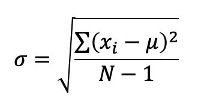
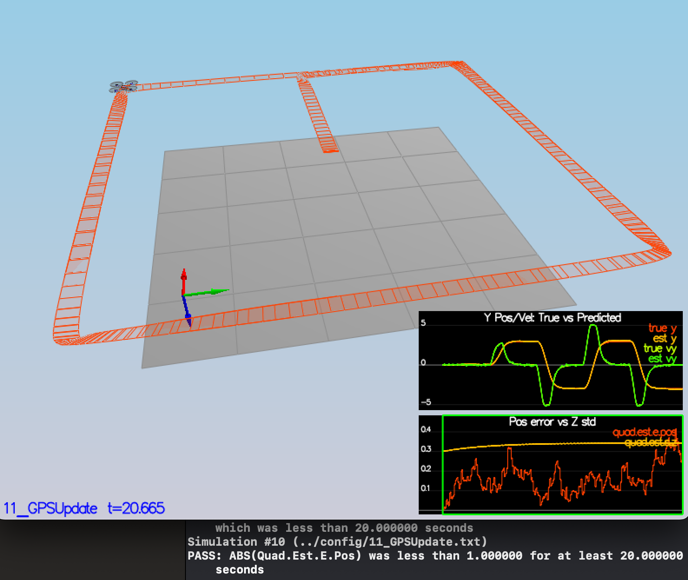

# Project 4: Building an Estimator 
##Project Scope
This project aims at developing the estimation portion of the controller developed in Project 3 (Module 3 of the Flying Cars and Autonomous Flight Engineering Nanodegree) that runs a quadrotor in the C++ simulator. 

In order to get an estimation of the state, the estimator exploits the measured data provided by the following sensors of the quadrotor :

+ **IMU**, whose accelerometers and gyros provide the linear accelerations in the world frame and the angular velocities (or body rates) in body frame of the quadrotor.
+ **GPS**, that provides the measured location and velocity of the quadrotor
+ **Magnetometer**, that provides the yaw angle of the quadrotor.

Note that, instead of using the corresponding output values from the controller, the accelerations and yaw angular velocity coming from the IMU will be used as the control input (or state vector) of the estimator. In other words, the  control input of the estimator is not going to be the collective thrust and the three moments produced by the control module but the x, y, and z accelerations and yaw rate of change measured by the IMU of the quadrotor.

This is clearly a simplification (trade-off) of the problem and the math involved. But at the same time, it is something that fits well with lower cost drones, where the control commands do not always accurately reflect the controls that actually got executed, while the measurements made by the IMU actually do reflect reality. Therefore, because the IMU directly measures these accelerations, and acceleration is in some sense what we are controlling when we are moving the drone around, we will take the IMU as our control input of the estimator.

The estimator has the following building blocks:

+ **A Nonlinear Complementary Filter** for the estimation of roll and pitch angles
+ **An Extended Kalman Filter** for position, velocity and yaw estimation 
+ **And the provision of direct gyro measurements** for body rates

Next figure shows an overview of the whole estimator and the interactions (inputs, outputs) between its building blocks as well as with the controller, and the own vehicle (the quadrotor being controlled). 

The resulting code will interact with the controller of a quadrotor that flyes in a synthetic environment: the so-called C++ simulator. This simulator provides different fly scenarios.

The simulator and project scenarios were largely designed and built by [Fotokite's](https://fotokite.com) team and [Sergei Lupashin](https://www.youtube.com/watch?v=9dXEam9kVKk) in particular. The C++ simulator can be download from and installed according to its [Github repository](https://github.com/udacity/FCND-Controls-CPP).

## Writeup
This brief report discusses on how the rubric points for passing Project 4 are addressed. It includes brief explanations, statements and supporting images, including screenshots of the piece of code in which each step is handled.

## Implement Estimator
### Determine the standard deviation of a noisy sensor
Real sensors are noisy. This fact creates a dispersion in the values that the sensor provides regarding the "actual" value that is being measured. Assuming that this dispersion follows a Gaussian distribution, which is often pretty accurate, the noise of a specific sensor can be characterized by the standard deviation of that Gaussian distribution. 

The calculation of the standard deviation of data collected from a sample of a population (not the whole population) is done with the following expression, being: *&mu;* the mean of the sampled data; *xi* each sampled data; and *N* the number of values in the sample. 

On this basis, the standard deviations of the noise for both GPS x data and accelerometer x data are calculated as follows.

+ Scenario 06 of the C++ simulator, where a quadrotor hovers in a given location, is used to collect sensor data. Note that for every episode, that scenario records the data in the following .txt files (csv format): `../config/log/Graph1.txt` (GPS x data) and `--/config/log/Graph2.txt` (accelerometer x data).

+ Once the data is collected and processed with the aforementioned formula, **it turns out that the standard deviations are 0.71 and 0.51 for GPS-X and IMU-X-acceleration respectively**.

+ These values are then entered in the `MeasuredStdDev_GPSPosXY` and `MeasuredStdDev_AccelXY` parameters at the `../config/6_Sensornoise.txt` file.

+ At last, scenario 06 is run again in order to check that the standard deviations have been calculated correctly to capture some 68% of the sensor measurements, which is what we expect within +/- 1 sigma bound for a Gaussian noise model. Operationally, the dashed lines in the two plots at the bottom of the simulator window eventually turn green when that condition is fulfilled (see next picture).

### Improve the attitude estimator

The first part of the estimator deals with the estimation of attitude, namely: the roll (*&phi;*), pitch (*&theta;*) and yaw (*&psi;*) angles of the state of the quadrotor. To that end, the estimator makes use of the information provided by the IMU, in particular, the gyro angular velocities and the pitch and roll angles as estimated from the accelerometers.

A Complementary Filter algorithm is placed at the core of the attitude estimator for the estimation of roll and pitch angles, whereas the yaw angle is estimated by direct integration in of the gyros measurements.

The Complementary Filter algorithm carries out a **sensor fusion** between the estimate from the measure of the gyros and that from the measure of the accelerometers. It applies a high pass filter to the former and a low pass filter to the latter. The logic behind is that the accelerometer give us a much noisier estimate but is much less susceptible to drift than the integration of the gyro measurement. Therefore, we put a low pass filter on the noisy estimate and a high pass filter on the gyro estimate.

In the case of pitch estimate, the algorithm is as follows (similar for the roll estimate).

If the roll and pitch angles are small and remain small during the flight of the quadrotor, a Linear Complementary Filter gives satisfactory results (this was the situation of the code provided for the estimator at the start of Project 4). However, in the more general case in which the roll and pitch angles can take any value, not necessarily small, the Linear approach is not accurate enough and a Nonlinear Complementary Filter is preferred.

The basic difference between both approaches is in the way the integration for getting the gyro estimate is done. If the roll and pitch angles are small, a Linear integration is feasible (the rate measured by the gyro in the body frame 'p' approximates the global turn rates &theta;_dot) and is carry out according to the following linear expression:

But for the general case, the rotation matrix must be considered, and this is a source of nonlinearity. Luckily, embracing quaternion formulation makes the math easy, and predicted quaternion can be calculated as follows (from 'Estimation for Quadrotors' paper, eq. 43 and 44), being: *qt* the quaternion for the Euler angles of the previous estimated (in world frame); and *dq* the integration in dtIMU of the body rates as measured by gyros (in body frame)

On this theoretical background, the implementation of the Nonlinear Complimentary Filter in the function `UpdateFromIMU()` of the `QuadEstimatorEKF.cpp` file has been done with the code shown below. Note again the use of the yaw angle, evaluated directly from integration of the gyros measures and a needed element for the quaternion calculation, but not being processed by the Complementary Filter.

This code has been tested in scenario 07 of the C++ simulator in order to check that the error in attitude estimate is less than 0.1 rad for each of the Euler angles for a duration of at least 3 seconds during the simulation (see next picture).

### Implement the predict step
The second main building block of the Estimator deals with the position and  velocity estimation by means of an Extended Kalman Filter (EKF).

The EKF is one particular implementation of the more general Bayes Filter, in which the distribution over the "belief" state is assumed Gaussian and, therefore, is represented by the mean and covariance values. Moreover, the EKF is the extension of the basic Kalman Filter (KF) for the case in which the transition state and the observation models are nonlinear.

Next is shown the pseudocode of the EKF (taken from 'Estimation for Quadrotors' paper). Its implementation has got two main steps: prediction and update.

Against this background, the following segments of code has been implemented in the `QuadEstimatorEKF.cpp` file: 

+ The forward step of the current state  by time dt using current accelerations and body rates as input in the function `PredictState`, 

+ The partial derivative of the Rbg rotation matrix with respect to yaw in the function `GetRbgPrime`

+ Building of the Jacovian of the transition function and update of the state covariance in the function `Predict`.

The proper implementation of the `PredictState`function is checked in scenario 08 of the C++ simulator in order to check that estimator state track the actual state, with only reasonably slow drift (see next picture).

In addition, the update of the state covariance that this code eventually predicts has been tested and tuned in scenario 08 of the C++ simulator. In particular, the `QPosXYStd` and the `QVelXYStd` parameters in the `QuadEstimatorEKF.txt` file have been tuned to 0.05 and 0.25 respectively in order to properly capture the magnitude of the error observed in the simulator (see next picture).

### Implement the magnetometer update
The magnetometer update is quite straight forward. Following 'Estimation for Quadrotors' paper, eq. 56 and 58, the resulting code, as implemented in the `UpdateFromMag` function of the `QuadEstimatorEKF.cpp` file, is shown next. The only remark is the need to normalize the difference between the measured and the estimated yaw between -pi and +pi.

This code has been tested and tuned in scenario 10 of the C++ simulator. In particular, the `QYawStd ` parameter in the `QuadEstimatorEKF.txt` file has been tuned to 0.075 in order to have an estimated standard deviation that accurately captures the drift error and, at the same time, maintains the error value lower than 0.1 rad in heading for at least 10 seconds during the simulation (see next picture).

### Implement the GPS update
Likely the magnetometer, the GPS update is also quite straight forward, though involving more matrix elements of the partial derivative of the observation model.

Following 'Estimation for Quadrotors' paper, eq. 53 and 55, the resulting code, as implemented in the `UpdateFromGPS` function of the `QuadEstimatorEKF.cpp` file is shown next.

This code has been tested and tuned in scenario 11 of the C++ simulator, using both an ideal estimator and ideal IMU as well as with a real estimator and realistic sensors. In particular, the `QPosZStd` and `QVelZStd` parameters in the `QuadEstimatorEKF.txt` file have been tuned to 0.08 and 0.15 respectively in order to have an overall estimated position error lower than 1 m when the quadrotor flies in this scenario (see next two pictures: first ideal; second realistic).
 

Note that the switch between ideal/real estimator and ideal/realistic IMU is carried out setting properly the following parameters in the `11_GPSUpdate.txt` file, which defines the conditions in which this scenario runs.

## Flight Evaluation

### Meet the performance criteria of each step

As reported in the previous sections, for each step of the project, the estimator created, once its parameters have been properly adjusted in the `QuadEstimatorEKF.txt` file as shown next, is able to successfully meet the performance criteria with the original controller provided.

	   QPosXYStd = 0.05
	   QVelXYStd = 0.25
	   QPosZStd = 0.0
	   QVelZStd = 0.15
	   QYawStd = 0.075

### De-tune the contoller parameters
The estimator developed in this Project 4 is connected to the flight controller resulting from Project 3 (control). To that end, the `QuadController.cpp` and `QuadControlParams.txt` files are replaced with the corresponding files developed in the previous Project.

In this conditions, the estimator and the flight controller are run in scenario 11 of the C++ simulator for both ideal estimator and ideal IMU as well as for real estimator and realistic IMU, as done before.

The performance of the flight controller is slightly improved to work with a real estimator and realistic IMU by means of tuning some of the control parameters defined in `QuadControlParams.txt` file, regarding those coming from Project 3. The final tuned values of the flight controller are shown next:

	Position control gains:
	  kpPosXY = 2.8          # previously = 3
      kpPosZ = 3.2           # previously = 3.5
      KiPosZ = 23            # previously = 23
	
	Velocity control gains:
	  kpVelXY = 6.7          # previously = 9
      kpVelZ = 7.3           # previously = 10
     
 	Angle control gains
      kpBank = 8.5           # previously = 15
      kpYaw = 2.0            # previously = 3.5

	Angle rate gains
      kpPQR = 60, 60, 8      # previously = 60, 60, 8

At last the whole code, estimator from Project 4 and flight controller from Project 3 with tuned parameters, is tested in scenario 11 of the C++ simulator.

**The performance of the quadrotor is reasonable good in both ideal and realistic conditions. However, despite the huge effort deployed for getting the best possible tuned control parameters, the quadrotor experiences a swinging movement during all the flight when flies in realistic conditions. In addition, the quadrotor suffers from a sudden shake in the right leg of the circuit (particularly in the second lap). This creates a change of its flight path, from which, nevertheless, the flight controller is able to recover a stable flight but with some diversion from the original track.**

See this behavior in the next two pictures (first for ideal estimator and ideal IMU; second for real estimator and realistic IMU).

